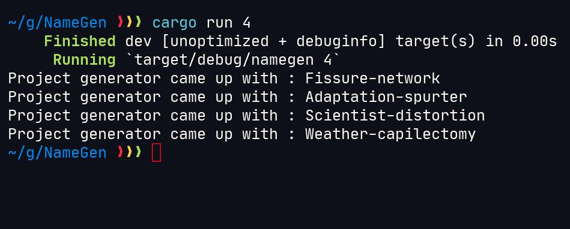

# Project Name Generator 

A project name generator written in rust, it's the most basic name generator one can find.

## How to use :

To run this you ofc need cargo toolchain installed and do this in the project root: 
```
cargo run
```
If you want multiple suggestions just enter a number along with cargo run like so :
```
cargo run 4
```
## Screenshots : 

